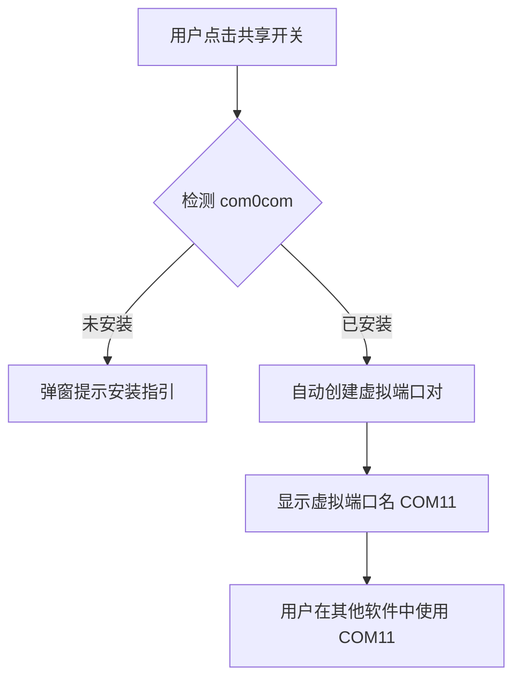

# com0com 串口共享功能实现计划

## 功能概述

集成 com0com 虚拟串口驱动，让用户在 SerialMaster 中开启"共享模式"后，其他软件可以同时访问同一个物理串口。


---

## 前置条件

用户需安装 [com0com](https://sourceforge.net/projects/com0com/) 驱动（我们在文档中提供安装指引）。

---

## 实现阶段

### Phase 1: 后端 Rust 模块

#### [NEW] [com0com_manager.rs](file:///d:/SerialMaster/src/core/com0com_manager.rs)

封装 com0com 的 `setupc.exe` 命令行操作：

```rust
pub struct Com0comManager {
    setupc_path: PathBuf,  // com0com 安装路径
}

impl Com0comManager {
    /// 检测 com0com 是否已安装
    pub fn is_installed() -> bool;
    
    /// 列出所有已创建的虚拟端口对
    pub fn list_pairs() -> Result<Vec<PortPair>>;
    
    /// 创建一个新的虚拟端口对
    pub fn create_pair(name_a: &str, name_b: &str) -> Result<PortPair>;
    
    /// 移除指定的虚拟端口对
    pub fn remove_pair(pair_id: u32) -> Result<()>;
}
```

#### [MODIFY] [serial_manager.rs](file:///d:/SerialMaster/src/core/serial_manager.rs)

添加共享模式数据桥接：
- 新增 `enable_sharing()` / `disable_sharing()` 方法
- 实现物理串口 ↔ 虚拟串口双向数据转发

#### [MODIFY] [commands.rs](file:///d:/SerialMaster/src/tauri/src/commands.rs)

新增 Tauri 命令：
- `check_com0com_installed` - 检测驱动安装状态
- `get_virtual_pairs` - 获取虚拟端口列表
- `enable_port_sharing` - 启用共享模式
- `disable_port_sharing` - 禁用共享模式

---

### Phase 2: 前端 UI

#### [MODIFY] [ControlPanel.tsx](file:///d:/SerialMaster/src/ui/src/components/ControlPanel.tsx)

在连接设置区域添加：

1. **共享模式开关** - 带状态指示
2. **虚拟端口显示** - 显示创建的虚拟端口名称（如 "COM11"）
3. **一键复制按钮** - 复制虚拟端口名称到剪贴板

UI 设计示意：
```
┌─────────────────────────────────────┐
│ 端口: COM8  波特率: 115200  [连接]  │
├─────────────────────────────────────┤
│ 🔗 端口共享模式                [开] │
│    虚拟端口: COM11         [📋复制] │
│    ⚠️ 其他软件请连接 COM11          │
└─────────────────────────────────────┘
```

---

### Phase 3: 文档更新

#### [MODIFY] [USER_GUIDE.md](file:///d:/SerialMaster/USER_GUIDE.md)

新增章节：**端口共享功能**
- com0com 驱动安装指引（含下载链接）
- 共享模式使用步骤
- 常见问题解答

---

## 用户体验流程



---

## 工作量估算

| 阶段 | 预计时间 |
|------|---------|
| Phase 1: 后端模块 | 3-4 天 |
| Phase 2: 前端 UI | 2-3 天 |
| Phase 3: 文档 | 1 天 |
| 测试与调试 | 2 天 |
| **总计** | **8-10 天** |

---

## 验证计划

### 自动化测试
1. 单元测试 `Com0comManager` 的命令解析
2. 集成测试：创建/删除虚拟端口对

### 手动验证
1. 安装 com0com 后启用共享模式
2. 使用 putty 连接虚拟端口
3. 验证双向数据通信正常
